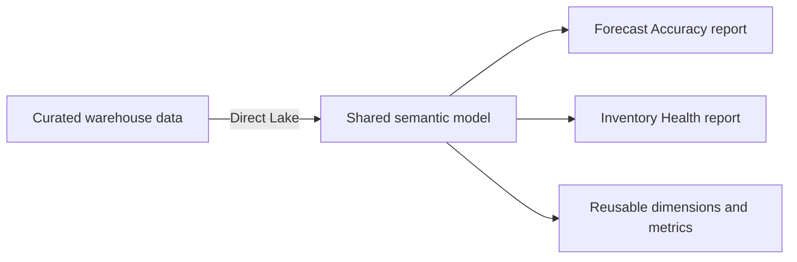
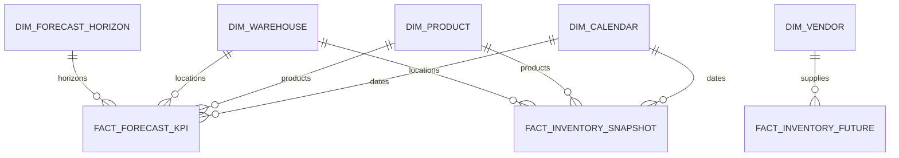

# Supply Chain Control Tower Semantic Model

A case study of the shared data model behind two Power BI products: **Forecast Accuracy** and **Inventory Health**.

In simple terms, this model gives both reports the same definitions for dates, products, warehouses, relationships, and reusable calculations. That consistency matters more than the number of measures in the model.

> [!NOTE]
> This is a privacy-safe architecture case study. It contains no company data, credentials, tenant identifiers, proprietary report exports, or production DAX source.

## In one minute

When each report defines its own metrics and business rules, two dashboards can give different answers to the same question. A shared semantic model provides one governed place for those rules.

The design reuses common concepts while keeping the two business areas separate where their data grain and logic are different.

## A small glossary

| Term | Plain-language meaning |
|---|---|
| Semantic model | The governed layer that connects tables and defines reusable calculations for reports |
| Dimension | A shared way to filter or group data, such as Date, Product, or Warehouse |
| Fact | A table of measurable events or snapshots, such as forecast error or inventory quantity |
| Grain | What one row represents |
| Direct Lake | A Fabric storage mode that lets Power BI query governed lake data without a separate full import copy |
| Measure | A calculation evaluated in the current report filters |

## Choose your path

| If you want to... | Start here |
|---|---|
| Understand the overall design | Read this page, then [`docs/model-design.md`](docs/model-design.md) |
| Browse the business metric families | [`docs/metric-catalog.md`](docs/metric-catalog.md) |
| Review architecture choices and trade-offs | [`docs/architecture-decisions.md`](docs/architecture-decisions.md) |
| See deployment, reliability, security, and ownership | [`docs/operations-and-delivery.md`](docs/operations-and-delivery.md) |
| Check what was observed versus proposed | [`docs/evidence-register.md`](docs/evidence-register.md) |
| Prepare for a project walkthrough | [`docs/interview-guide.md`](docs/interview-guide.md) |

## Model at a glance

The following counts were observed through read-only metadata on **2026-08-01**:

| Area | Observed snapshot |
|---|---:|
| Model tables | 27 |
| Relationships | 22 |
| Forecast Accuracy measures | 89 |
| Inventory Health measures | 456 |
| Storage mode | Direct Lake for governed facts and dimensions |
| Shared dimensions | Calendar, Product, Warehouse |
| Domain dimensions | Customer Grouping, Forecast Horizon, Vendor |

The model has a large measure library because it also supports comparisons, formatting, written explanations, and report interactions. That size is a governance and testing challenge—not a success metric.

## Core relationship pattern

This is a simplified view of the main pattern, not a diagram of all 22 relationships. Most filters move in one direction from dimensions to facts, which keeps behavior predictable and reduces ambiguous paths.

## Who owns which logic?

| Layer | Responsibility |
|---|---|
| Curated warehouse | Stable row-level data, keys, and fact grain |
| Semantic model | Shared relationships, business calculations, and metric names |
| Reports | Page flow, interactions, and domain-specific user experience |

Keeping these boundaries clear makes changes easier to test and prevents a report-formatting rule from silently becoming business logic.

## Design choices

- Share Calendar, Product, and Warehouse; keep forecast and inventory facts at their own grains.
- Use single-direction star-schema relationships by default.
- Use small disconnected helper tables for user selections instead of global bidirectional filters.
- Keep reusable calculations in the semantic model and row-level shaping in the warehouse.
- Organize measures by purpose, owner, and lifecycle; test important calculations with repeatable queries.
- Block untrusted data before it reaches the reports.

See [architecture decisions](docs/architecture-decisions.md) for alternatives and the signals that would trigger a redesign.

## What is in the repository

| Path | What you will find |
|---|---|
| [`docs/model-design.md`](docs/model-design.md) | Boundaries, grains, relationships, and Direct Lake choices |
| [`docs/metric-catalog.md`](docs/metric-catalog.md) | Metric families and calculation intent |
| [`docs/architecture-decisions.md`](docs/architecture-decisions.md) | Decisions, alternatives, and trade-offs |
| [`docs/operations-and-delivery.md`](docs/operations-and-delivery.md) | Deployment, reliability, security, ownership, and scaling |
| [`docs/evidence-register.md`](docs/evidence-register.md) | Source and confidence level for each claim |
| [`model/model-summary.yaml`](model/model-summary.yaml) | Privacy-safe, machine-readable model summary |
| [`samples/dax-patterns.md`](samples/dax-patterns.md) | Generic DAX examples using fabricated objects |
| [`scripts/validate_portfolio.py`](scripts/validate_portfolio.py) | Automated structure, link, syntax, and privacy checks |

## Evidence and limits

Counts, storage mode, and report bindings are observed from the dated metadata snapshot. Trade-offs, controls, and scaling recommendations are inferred or proposed. They are not claims of production adoption, performance, savings, or individual ownership of the underlying enterprise solution.

## Related projects

- [Forecast Accuracy Analytics](https://github.com/vothai17072002/forecast-accuracy-analytics)
- [Inventory Health Control Tower](https://github.com/vothai17072002/inventory-health-control-tower)
- [Fabric Medallion Supply Chain Platform](https://github.com/vothai17072002/fabric-medallion-supply-chain-platform)
