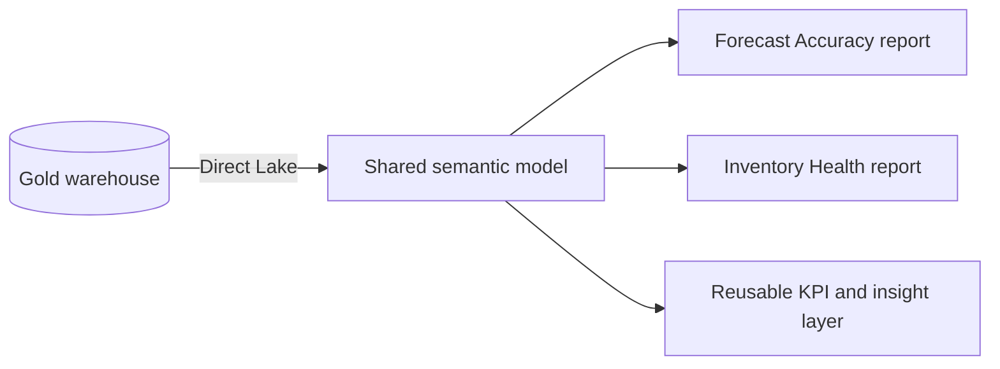
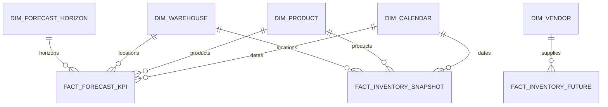

# Supply Chain Control Tower Semantic Model

A portfolio case study of a reusable Power BI semantic layer that serves two executive analytics products: Forecast Accuracy and Inventory Health.

> [!IMPORTANT]
> This repository is a sanitized architecture showcase. It contains no company data, credentials, tenant identifiers, proprietary report exports, or production DAX source.

## Why this project exists

Supply-chain analytics often fragments when every report defines its own calendar logic, product hierarchy, KPI vocabulary, and filter behavior. This model centralizes those contracts so multiple reports can share governed dimensions, facts, and measures while retaining domain-specific experiences.

## Model at a glance

| Area | Verified design snapshot |
|---|---:|
| Model tables | 27 |
| Relationships | 22 |
| Forecast Accuracy measures | 89 |
| Inventory Health measures | 456 |
| Storage mode | Direct Lake for governed facts and dimensions |
| Shared dimensions | Calendar, Product, Warehouse |
| Domain dimensions | Customer Grouping, Forecast Horizon, Vendor |

The large measure surface is organized into dedicated measure tables and helper dimensions. It includes business KPIs, comparison logic, conditional formatting, dynamic narratives, and report interaction helpers.

## Architecture

The model follows single-direction star-schema relationships. Disconnected helper tables drive comparison periods, horizon selection, risk buckets, metric switching, and display basis without creating ambiguous filter paths.

## Repository map

| Path | Purpose |
|---|---|
| [`docs/model-design.md`](docs/model-design.md) | Boundaries, grains, relationships, and Direct Lake choices |
| [`docs/metric-catalog.md`](docs/metric-catalog.md) | Interview-friendly KPI families and calculation intent |
| [`model/model-summary.yaml`](model/model-summary.yaml) | Sanitized, machine-readable model contract |
| [`samples/dax-patterns.md`](samples/dax-patterns.md) | Generic DAX patterns using synthetic names |
| `.tours/architect-overview.tour` | Guided architecture walkthrough for VS Code CodeTour |

## Design decisions

- Shared dimensions prevent conflicting calendar, product, and warehouse definitions.
- Domain facts remain separate because forecast and inventory operate at different grains.
- Direct Lake keeps the serving path close to the Gold warehouse while avoiding duplicated import pipelines.
- Dedicated measure tables separate business logic from physical fact tables.
- Disconnected parameter tables provide flexible UX without weakening the relationship graph.
- Data-quality gates belong before publication, not inside report visuals.

## What I can explain in an interview

- How to choose the grain of each fact and prevent double counting.
- Why single-direction relationships and conformed dimensions improve model reliability.
- How Direct Lake changes refresh, performance, and governance decisions.
- How to structure hundreds of measures into KPI, comparison, formatting, and narrative families.
- How one semantic model can serve distinct analytical products without becoming report-specific.

## Portfolio safety

All examples are generalized from observed architectural patterns. Object names are limited to generic analytical concepts, sample formulas use fabricated tables, and no operational endpoint or organization-specific asset is included.
