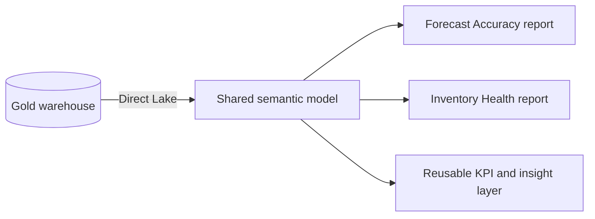
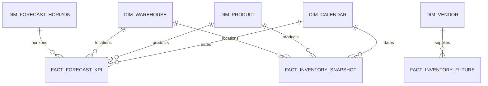

# Supply Chain Control Tower Semantic Model

A portfolio case study of a reusable Power BI semantic layer that serves two executive analytics products: Forecast Accuracy and Inventory Health.

> [!IMPORTANT]
> This repository is a sanitized architecture showcase. It contains no company data, credentials, tenant identifiers, proprietary report exports, or production DAX source.

## Executive brief

| | Senior/Lead view |
|---|---|
| Problem | Two decision products needed consistent dimensions, grains, and KPI definitions without duplicating semantic logic. |
| Architecture decision | Use one governed Direct Lake semantic model with conformed dimensions and bounded Forecast Accuracy and Inventory Health facts. |
| Main trade-off | Reuse and consistency improve, but model surface area, release coordination, and blast radius increase. |
| Operating principle | Gold owns stable serving grains; the semantic layer owns reusable business calculations; reports own user journeys. |
| Evidence boundary | Counts and bindings are **observed** from read-only metadata as of 2026-08-01. Trade-offs and controls are **inferred/proposed** and are not claimed production outcomes. |

## Why this project exists

Supply-chain analytics often fragments when every report defines its own calendar logic, product hierarchy, KPI vocabulary, and filter behavior. This model centralizes those contracts so multiple reports can share governed dimensions, facts, and measures while retaining domain-specific experiences.

## Model at a glance

| Area | Observed design snapshot (2026-08-01) |
|---|---:|
| Model tables | 27 |
| Relationships | 22 |
| Forecast Accuracy measures | 89 |
| Inventory Health measures | 456 |
| Storage mode | Direct Lake for governed facts and dimensions |
| Shared dimensions | Calendar, Product, Warehouse |
| Domain dimensions | Customer Grouping, Forecast Horizon, Vendor |

The large measure surface is organized into dedicated measure tables and helper dimensions. It includes business KPIs, comparison logic, conditional formatting, dynamic narratives, and report interaction helpers.

> [!NOTE]
> The ER diagram below is conceptual and intentionally shows the primary relationship pattern, not all 22 observed relationships.

## Architecture

The model follows single-direction star-schema relationships. Disconnected helper tables drive comparison periods, horizon selection, risk buckets, metric switching, and display basis without creating ambiguous filter paths.

## Repository map

| Path | Purpose |
|---|---|
| [`docs/model-design.md`](docs/model-design.md) | Boundaries, grains, relationships, and Direct Lake choices |
| [`docs/metric-catalog.md`](docs/metric-catalog.md) | Interview-friendly KPI families and calculation intent |
| [`docs/architecture-decisions.md`](docs/architecture-decisions.md) | ADR-style decisions, alternatives, consequences, and revisit triggers |
| [`docs/operations-and-delivery.md`](docs/operations-and-delivery.md) | Reliability, deployment, security, team ownership, and 10× scale plan |
| [`docs/interview-guide.md`](docs/interview-guide.md) | 30-second, 5-minute, and deep-dive discussion paths |
| [`docs/evidence-register.md`](docs/evidence-register.md) | Claim provenance, confidence boundaries, and interpretation limits |
| [`model/model-summary.yaml`](model/model-summary.yaml) | Sanitized, machine-readable model contract |
| [`samples/dax-patterns.md`](samples/dax-patterns.md) | Generic DAX patterns using synthetic names |
| [`scripts/validate_portfolio.py`](scripts/validate_portfolio.py) | CI gate for machine contracts, links, syntax, and public-release safety |
| `.tours/architect-overview.tour` | Guided architecture walkthrough for VS Code CodeTour |

## Leadership decisions and accountability

- **Model boundary:** share Calendar, Product, and Warehouse; keep forecast and inventory facts at independent grains.
- **Storage mode:** prefer Direct Lake for governed Gold objects, with an explicit fallback/performance test strategy.
- **Filter contract:** use single-direction star relationships; solve UX switching with disconnected helpers rather than global bidirectional filters.
- **Logic placement:** place reusable business calculations in the semantic layer and row-level shaping in Gold.
- **Measure governance:** treat 545 observed measures as a discoverability and regression risk requiring folders, ownership, golden queries, and deprecation rules.
- **Publication control:** block untrusted data before Gold/semantic consumption; do not hide data-quality failures in report formatting.

Detailed alternatives and consequences are recorded in [`docs/architecture-decisions.md`](docs/architecture-decisions.md).

## Quality attributes

| Attribute | Design response | Evidence status |
|---|---|---|
| Correctness | Declared fact grains, conformed keys, single-direction relationships, reconciliation gates | Design observed; automation proposed |
| Performance | Direct Lake, star schema, bounded helper tables, query-budget protocol | Architecture observed; target budget not evidenced |
| Reliability | Last trusted Gold publication, binding checks, rollback and incident runbook | Proposed operating contract |
| Security | Least privilege, Build permission review, RLS/OLS separation, export controls | Control framework proposed; tenant posture not assessed |
| Changeability | ADRs, machine-readable contract, CI validation, semantic regression tests | Portfolio implementation included; production adoption not claimed |
| Scalability | Capacity/concurrency monitoring and 10× evolution path | Scenario analysis, not measured production result |

## Senior/Team Lead discussion map

- How to choose the grain of each fact and prevent double counting.
- Why single-direction relationships and conformed dimensions improve model reliability.
- How Direct Lake changes refresh, performance, and governance decisions.
- How to structure hundreds of measures into KPI, comparison, formatting, and narrative families.
- How one semantic model can serve distinct analytical products without becoming report-specific.
- How I would assign decision rights across data engineering, semantic modeling, report product, governance, and operations.
- How the design fails, how it is detected, and what gets rolled back.
- What I would change at 10× data volume or concurrency—and which telemetry is needed before changing it.

For an executive-first walkthrough, use [`docs/interview-guide.md`](docs/interview-guide.md).

## Related case studies

- [Forecast Accuracy Analytics](https://github.com/vothai17072002/forecast-accuracy-analytics)
- [Inventory Health Control Tower](https://github.com/vothai17072002/inventory-health-control-tower)
- [Fabric Medallion Supply Chain Platform](https://github.com/vothai17072002/fabric-medallion-supply-chain-platform)

## Portfolio safety

All examples are generalized from observed architectural patterns. Object names are limited to generic analytical concepts, sample formulas use fabricated tables, and no operational endpoint or organization-specific asset is included. This repository demonstrates architectural reasoning; it does not assert individual authorship, team size, adoption, cost savings, or business impact without approved evidence.
