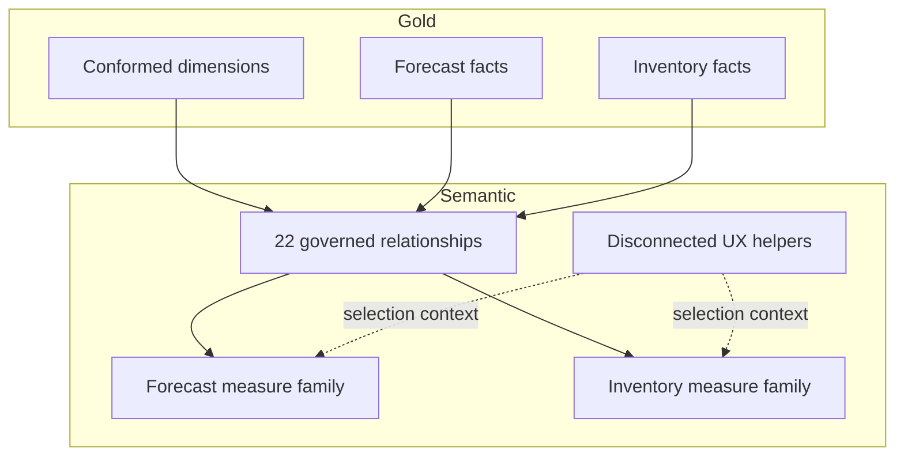

# Model design

> [!NOTE]
> This document separates the **observed model shape** from a **sanitized target contract**. Exact production column names and implementation details are intentionally withheld; proposed grain, key, and lifecycle rules must be bound to the deployable Gold and semantic definitions before release.

## Domain boundaries

The semantic layer combines two bounded analytical domains over conformed dimensions.

| Domain | Primary facts | Typical grain | Questions answered |
|---|---|---|---|
| Forecast Accuracy | Forecast-versus-actual and KPI facts | Product × warehouse × fiscal period × horizon | How accurate, biased, and value-adding is each forecast? |
| Inventory Health | Current snapshot and future-week facts | Product × warehouse × snapshot/future week | Where are shortage, surplus, service, and working-capital risks? |

## Grain and aggregation contracts

The following contracts are representative and sanitized. They make the failure boundary explicit without claiming the exact physical key list used in a production tenant.

| Semantic object | Contracted grain | Additivity and total behavior | Required release assertion |
|---|---|---|---|
| Forecast actual | Product × warehouse × fiscal period, extended by governed customer grain when applicable | Quantity is additive across products and locations for one period. Forecast horizon is deliberately excluded so actuals are not repeated when horizons are compared. | One row per declared composite key; reconcile quantity to the approved actuals source. |
| Forecast KPI | Product × warehouse × fiscal period × forecast horizon, extended by governed customer grain when applicable | Error numerators and denominators aggregate separately; percentages are recomputed as a ratio of sums rather than averaged. | Horizon membership is valid and forecast/actual eligibility rules resolve to one documented population. |
| Inventory snapshot | Product × warehouse × snapshot date, with any lower-level stock state declared as part of the key | Quantity and value are additive across product/location at one snapshot but **semi-additive over time**. Period totals select an agreed snapshot; they do not sum daily balances. | Composite grain is unique and the selected snapshot reconciles to the inventory control total. |
| Inventory future week | Product × warehouse × future week × governed movement/scenario, with vendor only where applicable | Flows may be summed within a week; projected balances must not be summed across overlapping horizons. | Horizon dates, scenario membership, and supply/demand signs pass contract tests. |
| Weekly classification/substatus | Product × warehouse × snapshot week × governed state | Counts and values are additive within one snapshot only. Mutually exclusive states must reconcile to the eligible population. | Exactly one terminal state per eligible entity unless an explicit bridge contract permits otherwise. |

### Key policy

- Gold resolves stable surrogate keys; semantic relationships do not rely on mutable labels or concatenated display values.
- The dimension side of every one-to-many relationship is unique, non-null, and type-compatible with its fact key.
- A governed unknown member handles legitimate early-arriving facts. Unexpected orphans fail publication rather than disappearing from totals.
- Composite grain tests run before semantic deployment; a duplicate is treated as a contract failure, not repaired with `DISTINCT` in a measure.
- Many-to-many relationships require an explicit bridge grain, allocation rule, owner, and total-behavior test.

## Conformed dimensions

- **Calendar** supports regular and fiscal analysis, rolling periods, and prior-period comparison.
- **Product** supplies governed attributes and lifecycle classifications.
- **Warehouse** provides the location grain shared across both domains.
- **Customer Grouping**, **Forecast Horizon**, and **Vendor** remain domain-oriented.

### Slowly changing and late-arriving data

- Use **Type 1** only where correcting an attribute should restate all history; use **Type 2** where the historical hierarchy, ownership, or classification must remain reproducible.
- Facts resolve a Type 2 surrogate key as of the business-effective date, not the ingestion timestamp.
- Early-arriving facts may use the governed unknown member and enter an exception queue; they are re-keyed after the dimension arrives and affected aggregates are reconciled.
- Late facts or corrections reopen a bounded processing window. Only impacted Gold partitions/snapshots are rebuilt, followed by semantic and report regression checks.
- Calendar roles such as actual period, forecast origin, snapshot date, and future week use role-playing dimensions or controlled inactive relationships. Only one intended date path is active for a calculation.

## Relationship rules

1. Dimensions filter facts in one direction.
2. Facts never filter other facts directly.
3. Business keys are aligned in Gold before reaching the model.
4. Disconnected tables handle selections that should not propagate as physical relationships.
5. Measures explicitly control alternate-date or comparison behavior.
6. Snapshot facts are never joined to flow facts to manufacture a common grain.
7. Relationship exceptions are documented with cardinality, filter direction, owner, and a test proving correct totals.

## Storage strategy

Governed fact and dimension tables use Direct Lake. Small UX helpers and measure containers remain calculated/import objects because they do not represent warehouse data.

Gold owns row-level shaping, conformed keys, durable history, and reusable aggregates. The semantic model owns relationship behavior, calculation semantics, formatting, and consumer-facing metadata. A transformation moves down to Gold when it is row-oriented, repeatedly scanned, shared outside Power BI, or required to make the serving grain trustworthy.

## Direct Lake headroom and 10× decision path

Direct Lake is an architectural choice, not a performance guarantee. Exact storage-mode transition and fallback behavior is platform/configuration dependent and must be observed in the target environment.

| Pressure signal | Evidence to collect | First response | Escalation trigger |
|---|---|---|---|
| High-cardinality or wide facts | Column cardinality, model footprint, query scans | Remove unused text columns, prefer stable numeric keys, narrow the Gold projection | Memory pressure or repeated query-budget breach persists |
| Longer history | Hot/cold access pattern and partition scan volume | Retain decision-relevant detail; introduce governed aggregates for older history | Detail retention and latency goals conflict |
| Higher concurrency | P50/P95 latency, queueing, capacity utilization | Reduce visual/query fan-out and expensive measure branches | Workloads compete despite tuning; isolate capacity or domain models |
| Expensive DAX | Server timings and golden-query plans | Fix iterator scope, filter propagation, and ratio-of-sums behavior | Reusable calculation still exceeds the agreed budget |
| Storage-mode transition/fallback | Platform/query telemetry and frequency by journey | Correct eligibility, layout, or query shape; retest on representative filters | Fallback remains material; assess import/aggregation or composite strategy |
| Shared-model blast radius | Change failure rate and domain release cadence | Enforce compatibility tests and deprecation windows | Independent security, capacity, or cadence needs outweigh reuse |

At 10×, the team changes architecture only after identifying which axis grew: rows, cardinality, history, measures, visual fan-out, or concurrent users. The response is benchmarked against the same representative query pack so a faster single query does not conceal worse freshness, cost, or concurrency.

## Release checks

- Relationship keys are unique on the dimension side.
- Fact grains are documented and tested against duplicates.
- Unknown-member and late-arrival exceptions are counted, owned, and within an approved tolerance.
- Measures return expected results under no-filter, single-select, and multi-select contexts.
- Snapshot and ratio measures pass subtotal/grand-total tests; security personas pass positive and negative tests.
- Direct Lake tables exist in the target Gold schema before deployment.
- Report bindings point to the intended environment.
- Row-level security roles are reviewed separately from workspace permissions.
- Representative queries meet an agreed latency/concurrency budget, or the exception is recorded and approved.
