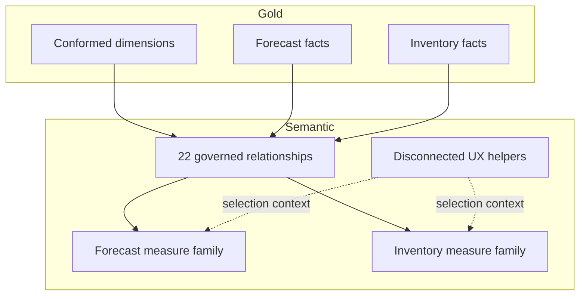

# Model design

## Domain boundaries

The semantic layer combines two bounded analytical domains over conformed dimensions.

| Domain | Primary facts | Typical grain | Questions answered |
|---|---|---|---|
| Forecast Accuracy | Forecast-versus-actual and KPI facts | Product × warehouse × fiscal period × horizon | How accurate, biased, and value-adding is each forecast? |
| Inventory Health | Current snapshot and future-week facts | Product × warehouse × snapshot/future week | Where are shortage, surplus, service, and working-capital risks? |

## Conformed dimensions

- **Calendar** supports regular and fiscal analysis, rolling periods, and prior-period comparison.
- **Product** supplies governed attributes and lifecycle classifications.
- **Warehouse** provides the location grain shared across both domains.
- **Customer Grouping**, **Forecast Horizon**, and **Vendor** remain domain-oriented.

## Relationship rules

1. Dimensions filter facts in one direction.
2. Facts never filter other facts directly.
3. Business keys are aligned in Gold before reaching the model.
4. Disconnected tables handle selections that should not propagate as physical relationships.
5. Measures explicitly control alternate-date or comparison behavior.

## Storage strategy

Governed fact and dimension tables use Direct Lake. Small UX helpers and measure containers remain calculated/import objects because they do not represent warehouse data.

## Release checks

- Relationship keys are unique on the dimension side.
- Fact grains are documented and tested against duplicates.
- Measures return expected results under no-filter, single-select, and multi-select contexts.
- Direct Lake tables exist in the target Gold schema before deployment.
- Report bindings point to the intended environment.
- Row-level security roles are reviewed separately from workspace permissions.
