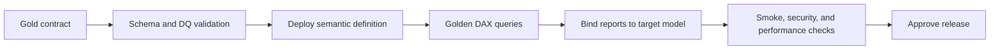

# Operations and delivery

## Quality-attribute scenarios

Targets below must be agreed from business SLAs and telemetry; this portfolio does not claim measured production values.

| Scenario | Signal | Response |
|---|---|---|
| Gold schema changes | Contract/manifest diff | Block deployment before model binding |
| Dimension key loses uniqueness | Grain and orphan-key tests | Quarantine publication and keep last trusted Gold version |
| Direct Lake falls back or slows | Query traces, capacity metrics, fallback telemetry | Remove unused/high-cardinality columns, tune Gold layout, evaluate import/aggregation fallback |
| Measure result regresses | Golden DAX queries by filter scenario | Stop release and compare semantic diff |
| Report points to wrong environment | Post-deploy binding assertion | Rebind to target model and rerun smoke tests |
| Access is over-broad | Access review and audit log | Remove Build/export rights; validate RLS/OLS separately |

## SLO framework

The owning team should define and review:

- data freshness and maximum trusted snapshot age;
- semantic query latency by critical user journey, including P95;
- refresh/reframe success rate;
- recovery-time and recovery-point objectives;
- report binding correctness;
- capacity saturation and Direct Lake fallback budget.

Absence of an agreed target is tracked as an operational gap—not silently represented as “healthy.”

## Deployment strategy

Rollback restores the previous semantic definition and report binding while preserving the last trusted Gold publication. Database, semantic, and report changes are versioned and promoted in dependency order.

## Team operating model

| Decision | Accountable role | Required collaborators |
|---|---|---|
| Fact grain and Gold contract | Data domain lead | Source owner, semantic lead, DQ owner |
| Relationship and measure API | Semantic model lead | Report product owners, governance |
| KPI definition and threshold | Business metric owner | Semantic lead, finance/operations representative |
| Capacity and performance budget | Platform lead | Semantic/report leads, FinOps |
| Production release | Service owner | Engineering, QA, security, business approver |
| Incident command | On-call service owner | Data, platform, semantic, report owners |

The team lead sets decision boundaries, review standards, and escalation paths; implementation remains distributed to domain owners.

## 10× scale response

Before redesigning, measure data volume, cardinality, query concurrency, capacity utilization, fallback behavior, and slow-query shape. Likely levers include reducing model width, separating hot/cold history, aggregate tables, incremental Gold processing, query simplification, capacity isolation, or domain model separation. Each lever trades cost, freshness, reuse, and operational complexity.

## Security posture

- Use managed identities/service principals for deployment and least-privilege workspace roles.
- Treat Build permission, export, Analyze in Excel, and sharing as data-exfiltration controls.
- Test RLS positive and negative cases; use OLS when metadata itself is sensitive.
- Apply sensitivity labels and audit access/exports.
- Separate workspace authorization from model-level data authorization.
- Review access periodically and after role/team changes.

